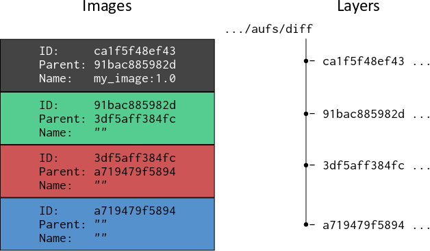
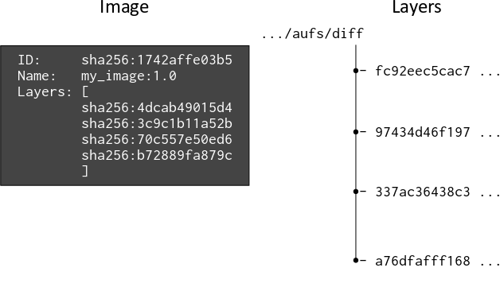

_原文地址：https://windsock.io/explaining-docker-image-ids/_
_Author：Nigel Brown_
_Translator：SU Hang_
_经原作者 Nigel Brown 授权翻译 | Translator authorized by the Nigel Brown_

当 Docker v1.10 发布时，Docker Engine 处理镜像的方式发生了相当大的变化。虽然这种[新的处理机制](https://blog.docker.com/2016/01/docker-1-10-rc/) 被解释得很清楚，并且对 Docker 的常规使用（除了镜像迁移之外）几乎没有影响，但是有一些 UI 变动还是引起了一些[误解](https://github.com/moby/moby/issues/20131)。那么这种变化是什么，为什么 `docker history` 命令会显示一些镜像层的 ID 为 `<missing>`呢？

<!--more-->

```bash
$ docker history debian
IMAGE               CREATED             CREATED BY                                      SIZE                COMMENT
1742affe03b5        10 days ago         /bin/sh -c #(nop) CMD ["/bin/bash"]             0 B
<missing>           10 days ago         /bin/sh -c #(nop) ADD file:5d8521419ad6cfb695   125.1 MB
```

#### 前言
首先交代一些相关背景。docker 镜像是用于创建容器的只读模板，并提供基于多层文件和目录的顺序联合的文件系统，这种[联合文件系统](https://en.wikipedia.org/wiki/Union_mount) 使得 Docker 镜像得以复用。Docker 平台提供了"共享镜像层"这一基本组件，通常使用[写时复制（COW）](https://zh.wikipedia.org/wiki/%E5%AF%AB%E5%85%A5%E6%99%82%E8%A4%87%E8%A3%BD) 机制来实现。在容器运行的生命周期中，如果容器需要从下层的某个只读镜像中修改文件，则在进行更改之前，它会将文件复制到其自己的专用读写层 - 即容器层。

在 Docker 镜像构建过程中，会创建一个镜像或'diff'，在容器中运行的命令 - 譬如上面提到的 `/bin/bash`等等 - 会生成新的或修改过的文件和目录。这些新的或修改过的文件和目录被“提交”到容器层。`docker history` 输出显示 `debian` 镜像有两层。

#### 历史遗留
历史上（在 Docker v1.10 版本之前），每次由于提交操作（译者注：`docker commit`) 而创建新镜像时，就会随机生成一个 256 位 [UUID](https://en.wikipedia.org/wiki/Universally_unique_identifier) 标识来代表这唯一镜像，通常称为镜像 ID（在 UI 中显示为短 12 位十六进制字符串或长 64 位十六进制字符串）。Docker 将镜像内容存储在名称与镜像 ID 相同的目录中。在该目录内部，包括镜像的配置信息 (configuration object ) 和 镜像 ID 和镜像的父镜像的 ID 和。通过这种方式，Docker 能够为容器构建文件系统，每个镜像依次引用其父镜像内容，直到到达没有父级的基本镜像。每一层镜像也可以用有意义的名称（例如 `my_image:1.0`）标记（可选，不强制），但这通常保留用于叶子镜像。这在下图中描述：



使用 `docker inspect` 命令将输出：
```bash
$ docker inspect my_image:1.0
[
    {
        "Id": "ca1f5f48ef431c0818d5e8797dfe707557bdc728fe7c3027c75de18f934a3b76",
        "Parent": "91bac885982d2d564c0e1869e8b8827c435eead714c06d4c670aaae616c1542c"
        ...
        ...
```
这种方法在很长一段时间都工作良好，但随着时间的推移，由于各种原因，它被认为是一种次优的选择。驱使作出改变的一个重要原因是：当从 Docker registry（如 [Docker Hub](https://hub.docker.com/)）中推送到或拉取时，缺乏检测镜像内容是否在被篡改的方法。这收到了整个社区的[强烈批评](https://github.com/moby/moby/issues/9719)，最终促使了内容可寻址 ID (content addressable IDs) 的诞生。

#### 内容可寻址 ID
从 Docker v1.10 开始，镜像和层级 (images and layers) 不再是同义词。除此之外，镜像可以直接引用一个或多个层级。

现在层级通过摘要来进行识别，摘要采用如下形式：`algorithm:hex` 例如：
```bash
sha256:fc92eec5cac70b0c324cec2933cd7db1c0eae7c9e2649e42d02e77eb6da0d15f
```

通过将 [SHA256](https://github.com/moby/moby/issues/9719) 算法应用于镜像的内容之上，来计算十六进制 hash 值。如果内容发生变化，则计算的摘要也将发生变化，这意味着 Docker 可以使用其发布的摘要来检查镜像的内容，以验证其是否被篡改。层级不同于"镜像"这个概念，也不属于"镜像"这个概念的一部分，它只是文件和目录的集合。

现在的 Docker 镜像由一个配置对象 (configuration object) 组成，配置对象中包含了一个有序层级摘要列表，这使得 Docker Engine 能够根据层级摘要而不是父镜像来组装容器的文件系统。镜像 ID 也是一个摘要，是镜像配置对象的 SHA256 哈希值，镜像配置对象涵盖了组成该镜像文件系统的所有"层级"的 hash 摘要。下图描绘了 Docker v1.10 之后镜像和层级之间的关系：



为了便于阅读，镜像和镜像的 SHA256 hash 摘要被缩短了。

用于存储层级内容的目录 `diff` , 现在以随机生成的“cache ID”命名，Docker Engine 维护层级与其 cache ID 之间的关联性，以便它在磁盘上定位层级内容的位置。

因此，当从 registery 中提取 Docker 镜像时，`docker history` 命令用于显示其内容，其输出类似于这样：
```bash
$ docker history swarm
IMAGE               CREATED             CREATED BY                                      SIZE                COMMENT
c54bba046158        9 days ago          /bin/sh -c #(nop) CMD ["--help"]                0 B
<missing>           9 days ago          /bin/sh -c #(nop) ENTRYPOINT &{["/swarm"]}      0 B
<missing>           9 days ago          /bin/sh -c #(nop) VOLUME [/.swarm]              0 B
<missing>           9 days ago          /bin/sh -c #(nop) EXPOSE 2375/tcp               0 B
<missing>           9 days ago          /bin/sh -c #(nop) ENV SWARM_HOST=:2375          0 B
<missing>           9 days ago          /bin/sh -c #(nop) COPY dir:b76b2255a3b423981a   0 B
<missing>           9 days ago          /bin/sh -c #(nop) COPY file:5acf949e76228329d   277.2 kB
<missing>           9 days ago          /bin/sh -c #(nop) COPY file:a2157cec2320f541a   19.06 MB
```

该命令提供具体镜像及其层级的详细组成信息。除了镜像的最上面一个层级之外（译者注：这不一定）, 所有 `IMAGE` 字段中的值都是`<missing>`, 很不幸，这个值极具误导性，因为它给人一种错误的暗示。但严格来说这么做没错，因为层级不再与镜像同义。我认为把这个领域留空是更恰当的（译者在这里表示赞同）。此外，镜像 ID 似乎仅仅与最上层相关联，但实际上，镜像 ID 不属于任何层。相反，这些层级共同属于该镜像。

#### 本地构建镜像
虽然这个内容可寻址镜像的描述适用于 Docker v1.10 版本 之后的所有 Docker 镜像，但 Docker 主机上的本地构建镜像的方式略有不同。本地构建的镜像保持不变 - 它是包含配置项的配置对象，包括层级摘要的有序列表。

但是，当本地 Docker 主机上构建的层级提交给镜像时，会同时创建“中间”镜像。与所有其他镜像一样，"中间镜像"也具有配置项，该配置项是组成镜像的层级摘要列表，并且其 ID（或摘要）包含配置对象的 hash 值。中间镜像没有标记名 (tag name)，但是，它们有一个“父”键（译者注：原文这里有点小瑕疵，不是"父"键，在代码中是以对象成员表示的），其中包含父镜像的 ID。

使用中间镜像和包含对父镜像的引用的目的，是为了便于 Docker [构建缓存](https://docs.docker.com/engine/reference/builder/#from) 。构建缓存是 Docker 平台的另一个重要特性，用于帮助 Docker 引擎利用预先存在的层级，以免为相同的构建命令不必要地重复生成内容。它使得构建过程更有效。在本地构建镜像时，该 `docker history` 命令可能提供类似于以下内容的输出：

```bash
$ docker history jbloggs/my_image:latest
IMAGE               CREATED             CREATED BY                                      SIZE                COMMENT
26cca5b0c787        52 seconds ago      /bin/sh -c #(nop) CMD ["/bin/sh" "-c" "/bin/b   0 B
97e47fb9e0a6        52 seconds ago      /bin/sh -c apt-get update &&     apt-get inst   16.98 MB
1742affe03b5        13 days ago         /bin/sh -c #(nop) CMD ["/bin/bash"]             0 B
<missing>           13 days ago         /bin/sh -c #(nop) ADD file:5d8521419ad6cfb695   125.1 MB
```

在此示例中，上面两个层级是在本地镜像构建期间创建的，而底层是来自基本镜像（例如 [Dockerfile 指令](https://docs.docker.com/engine/reference/builder/#from) `FROM debian`）。我们可以使用 `docker inspect` 命令查看与该镜像关联的层级摘要：

```
$ docker inspect jboggs/my_image:latest
[
    {
        ...
        ...
        "RootFS": {
            "Type": "layers",
            "Layers": [
                "sha256:4dcab49015d47e8f300ec33400a02cebc7b54cadd09c37e49eccbc655279da90",
                "sha256:5f70bf18a086007016e948b04aed3b82103a36bea41755b6cddfaf10ace3c6ef",
                "sha256:f22bfbc1df820c465d94215e45bf9b1f0ae0fe3435a90dc5296a4b55712f46e7"
            ]
        }
    }
]
```

`docker history` 命令显示镜像具有四个层级，但 `docker inspect` 显示仅包含三个镜像。这是因为两条 `CMD` 指令仅为镜像生成元数据，不添加任何实质性内容，因此'diff'为空。摘要 5f70bf18a08a 是空镜像的 SHA256 哈希值，由两个相关层共享。

被推送到 registry 的本地构建镜像，是仅有的"叶子镜像", 与它的组成层级一同上传，并随后由另一个 Docker 主机拉取，这过程将不会产生任何中间父镜像。这是因为一旦借助 registry 将镜像提供给不同 Docker 主机上的其他潜在用户时，它的属性将变为只读，并且不再需要构建缓存 (build cache) 组件的支持。所以此时，`<missing>`值将被插入到其相应位置。

将镜像推送到 registry 可能会产生如下输出：
```bash
$ docker push jbloggs/my_image:latest
The push refers to a repository [docker.io/jbloggs/my_image]
f22bfbc1df82: Pushed
5f70bf18a086: Layer already exists
4dcab49015d4: Layer already exists
latest: digest: sha256:7f63e3661b1377e2658e458ac1ff6d5e0079f0cfd9ff2830786d1b45ae1bb820 size: 3147
```

在此示例中，仅推送了一个层级，因为 registry 中已存在两个层级，这两个层级可能被一个或多个其他镜像引用。

#### 最后的"小别扭"
Docker 的层级“diffs”摘要，包含 `diff`目录 的 tar 包的 sha256 hash 值。在将镜像上传到 registry 之前，会对其进行压缩以提高带宽效率。除此之外，还会创建清单 (manifest) 来描述镜像的内容，它包含压缩层级内容的摘要。因此，清单中的层级摘要与在其未压缩状态下生成的摘要不同。该清单也会被推送到 registry。

压缩层 diff 的摘要可以被称为“分发摘要”，而未压缩层 diff 的摘要可以被称为“内容摘要”。因此，当我们在不同的 Docker 主机上提取示例镜像时，`docker pull` 命令会提供以下输出：

```bash
$ docker pull jbloggs/my_image
Using default tag: latest
latest: Pulling from jbloggs/my_image

51f5c6a04d83: Pull complete
a3ed95caeb02: Pull complete
9a246d793396: Pull complete
Digest: sha256:7f63e3661b1377e2658e458ac1ff6d5e0079f0cfd9ff2830786d1b45ae1bb820
Status: Downloaded newer image for jbloggs/my_image:latest
```

`docker pull` 命令输出中的分发摘要，与`docker push`命令输出的摘要非常不同 。但是，pull 将解压缩层级，`docker inspect` 命令的输出将与我们在构建镜像后看到的内容摘要相同。

#### 总结
在 Docker v1.10 中更改镜像和镜像处理机制之后：

* Docker 镜像基于它存储到层级差异 (diffs) 的引用为派生容器提供文件系统；
* 使用摘要引用层级差异 (diffs)，摘要包含差异 (diffs) 内容归档（译者注：就是 tar 包）的 SHA256 hash 值；
* Docker 镜像的 ID 是一个摘要，其中包含镜像的 JSON 配置对象的 SHA256 哈希值；
* 为了维护构建缓存，Docker 在本地镜像构建期间会创建中间镜像；
* 镜像清单会在推送镜像时一并推送到 Docker registry;
* 镜像清单包含镜像层级的摘要，其中包含压缩的归档差异内容的 SHA256 哈希值；
